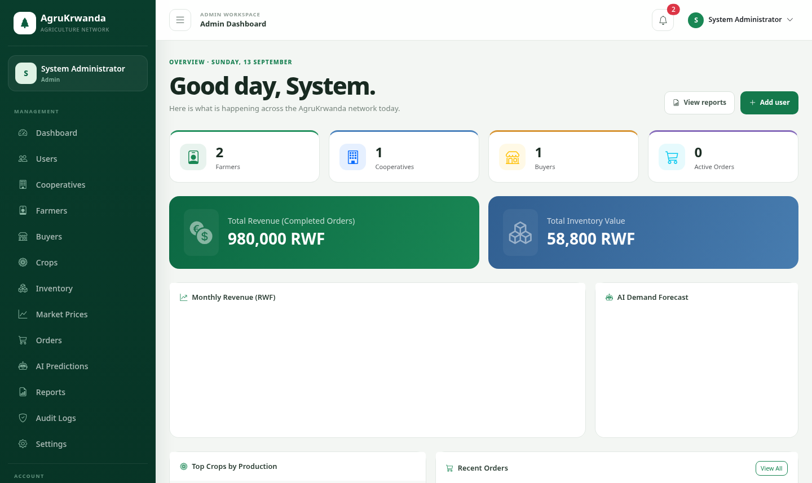

# AgruKrwanda 🌾

A web-based agricultural management platform built for Rwanda, connecting farmers, cooperatives, buyers, and administrators to streamline crop production, market pricing, and trade.

---

## 🚀 Features

- **Admin** — Manage users, cooperatives, farmers, buyers, crops, inventory, market prices, orders, AI predictions, and reports
- **Cooperative Manager** — Track member farmers, harvests, inventory, production plans, AI predictions, and generate reports
- **Farmer** — Record harvests, view market prices, AI crop recommendations, and sales history
- **Buyer** — Browse marketplace, place orders, track deliveries, and view market prices
- **Public** — View live market prices, about page, and contact

---

## 🛠️ Tech Stack

| Layer | Technology |
|-------|-----------|
| Backend | PHP 8.2 (Custom MVC) |
| Database | MySQL |
| Frontend | Bootstrap 5.3, Chart.js 4.4 |
| Server | Apache (LAMPP) |
| Currency | RWF (Rwandan Franc) |
| Timezone | Africa/Kigali |

---

## 📁 Project Structure

```
agrukrwanda/
├── app/
│   ├── controllers/       # AdminController, FarmerController, BuyerController, etc.
│   ├── models/            # All database models
│   ├── views/             # Role-based views (admin, farmer, buyer, cooperative, public)
│   ├── helpers/           # Auth, Helper utilities
│   └── services/          # AIPredictionService, NotificationService, AuditLogger
├── config/                # app.php, database.php
├── database/
│   ├── schema.sql         # Full database schema (28 tables)
│   ├── seeds.sql          # Sample seed data
│   └── install.php        # Database installer
├── public/                # Web root (index.php, assets)
├── routes/                # Router.php, web.php
└── agrukrwanda.sql        # Full database dump
```

---

## ⚙️ Installation

### Requirements
- PHP 8.2+
- MySQL 5.7+
- Apache with `mod_rewrite` enabled (XAMPP/LAMPP recommended)

### Steps

1. **Clone the repository**
   ```bash
   git clone https://github.com/niyomudendezo/uwayisenga.git
   cd uwayisenga
   ```

2. **Place in web root**
   ```bash
   # For LAMPP on Linux
   sudo mv uwayisenga /opt/lampp/htdocs/agrukrwanda
   ```

3. **Import the database**
   ```bash
   mysql -u root -p -e "CREATE DATABASE agrukrwanda;"
   mysql -u root -p agrukrwanda < agrukrwanda.sql
   ```

4. **Configure the app**

   Edit `config/database.php`:
   ```php
   define('DB_HOST', 'localhost');
   define('DB_NAME', 'agrukrwanda');
   define('DB_USER', 'root');
   define('DB_PASS', '');
   ```

   Edit `config/app.php`:
   ```php
   define('APP_URL', 'http://localhost/agrukrwanda');
   ```

5. **Start Apache & MySQL**, then open:
   ```
   http://localhost/agrukrwanda
   ```

---

## 👤 Default Login Credentials

| Role | Email | Password |
|------|-------|----------|
| Admin | admin@agrukrwanda.rw | password |
| Cooperative | coop@agrukrwanda.rw | password |
| Farmer | farmer@agrukrwanda.rw | password |
| Buyer | buyer@agrukrwanda.rw | password |

---

## 📸 Screenshots

| Homepage | Admin Dashboard |
|----------|----------------|
|  |  |

---

## 📄 Research

Full undergraduate research chapters (Introduction, Literature Review, Methodology) are available at:
```
http://localhost/agrukrwanda/public/RESEARCH_CHAPTERS.txt
```

---

## 👨‍💻 Author

**Uwayisenga** — Undergraduate Project, Rwanda  
GitHub: [@niyomudendezo](https://github.com/niyomudendezo)
